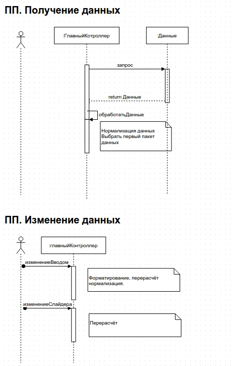

# Тестовая работа для ru.getloyalty

## [Финальный результат](http://pashaigood.github.io/ru.getloyalty.testwork)

## О проекте
Больше всего времени ушло на алгоритм распределения. 
Также рассматривал различные варианты обработки изменений, таких как: 
* $watch
* Отдельная директива
* Обработка события изменения, на нём и остановился.

Данный способ показался самым простым, а реализованной алгоритм,
с небольшими изменениями может быть применим и к другим способам.

Не стал выделять функционал в отдельную директиву, так как посчитал, что в контексте задание в этом нет необходимости.

## Процесс
1. Начал с проектирования, накидал псевдо последовательность. 

1. Накидал задачек в [trello.com/ru-getloyalty-testwork](https://trello.com/b/3X0XXhub/ru-getloyalty-testwork)
1. Запустил свой любимый генератор `yo gulp-angular`.
1. Создал репозиторий и начал кодить!

## TODO
* e2e тесты.
* Дополнительные проверки на корректность данных.
* Тестирование в других браузерах, разработак велась по Google Chrome на Ubuntu.
* Убрать не используемые компоненты стилей bootstrap.